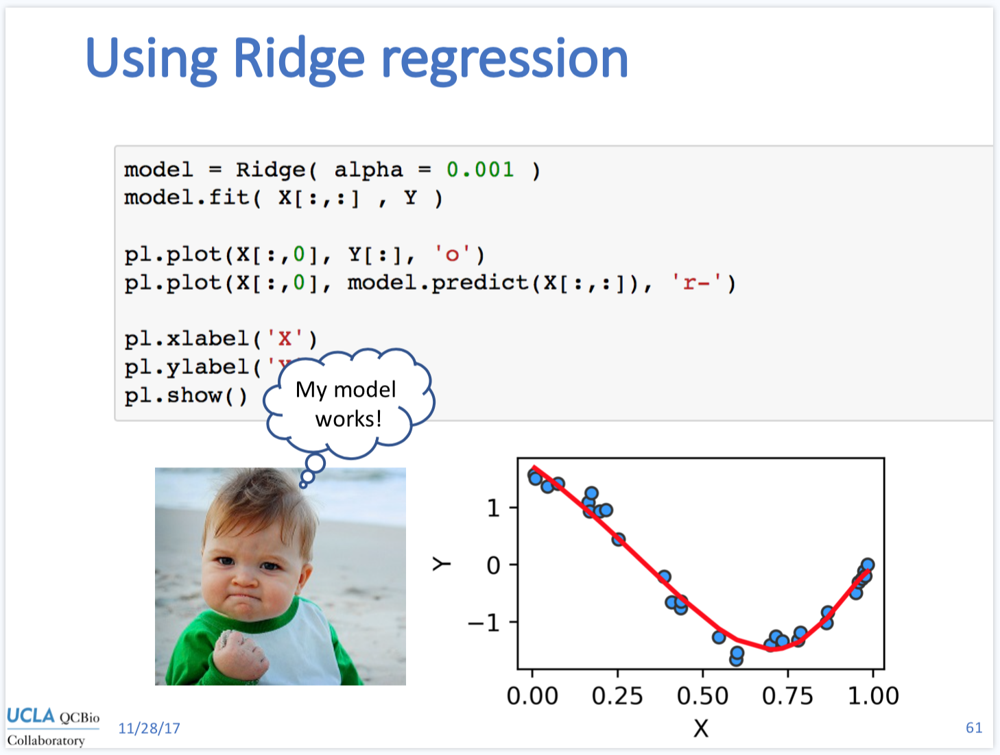

## Day 3 - Regression and clustering

The slides from Day 3 are available [here](https://www.dropbox.com/s/szmxeqclhgcjwq5/MachineLearning_Python_Collaboratory_day3.pdf?dl=0).

### Class materials

* [Click here](https://github.com/QCB-Collaboratory/W17.MachineLearning/raw/master/materials/day_2/Day2_testdataset.zip) for the dataset used with regression.
* [Jupyter Notebook](http://nbviewer.jupyter.org/github/QCB-Collaboratory/W17.MachineLearning/blob/master/materials/day_3/Pratice_Day_3.ipynb) with the code from day 3
