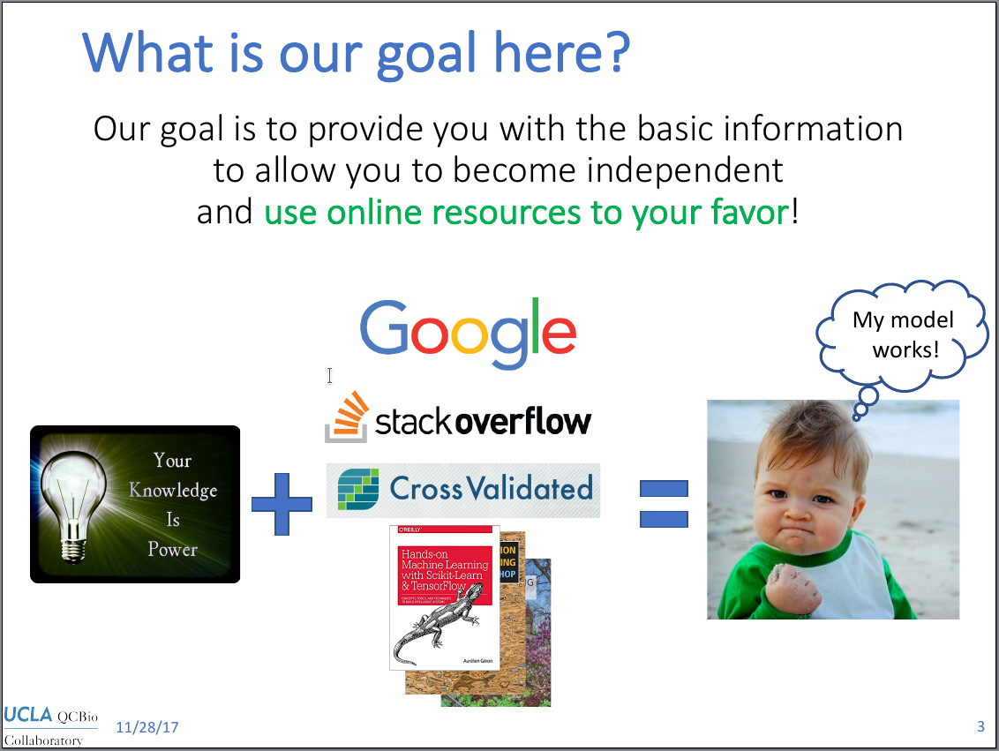
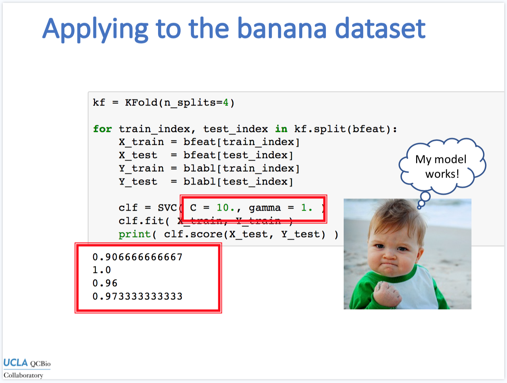
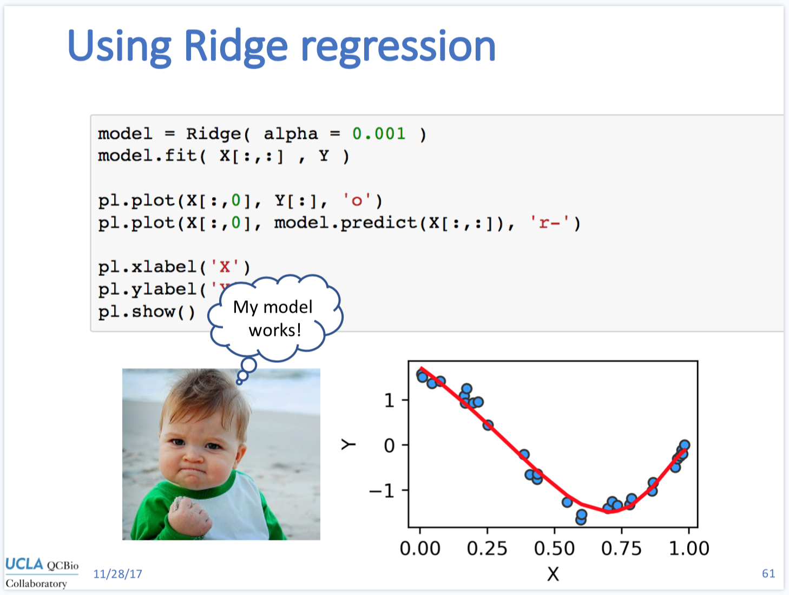

# Machine Learning Workshop

This is the homepage for the Collaboratory Workshop, Machine Learning with Python (November 2017). I will be updating this website after the workshop is finished to fix any problems we may have found in the slides, and post the videos of each the three days. This workshop is offered by the [QCBio Collaboratory](https://qcb.ucla.edu/collaboratory/workshops/machinelearning/) (UCLA).

#### Table of contents

* [Day 1](./README.md#day1) - Jupyter and Machine Learning

* [Day 2](./README.md#day2) - Classification and performance

* [Day 3](./README.md#day3) - Cross-validation and regression

* [Resources of after the workshop](./README.md#after-the-workshop)

* [Contact us!](./README.md#contact)

 

## Workshop description

In this workshop, we explore applications of Machine Learning to analyze biological data without the need of advanced programming skills. For example, Machine Learning techniques can be used to construct predictive models based on a set of training examples, to remove noise and spurious artifacts from data (e.g. photobleaching), or to help visualize trends within high dimensional datasets, etc. This workshop will cover the basic principles involved in the applications mentioned above, such as pattern recognition, linear and non-linear regression and cluster analysis. The workshop will be oriented towards hands-on activities, starting from the basics of how to load and prepare biological datasets in a Python environment. By the end of this workshop, students will be able to use Scikit-Learn’s documentation (and other libraries) to build models based on their own data, assess their performance and make new predictions.

Students are encouraged to attend to the Advanced Python and Modern Statistics workshops, although no advanced knowledge will be assumed.

#### Technical requirements

Attendees should have a working copy of Python 2 or 3 with the following packages:
* Numpy
* Matplotlib
* Scikit-Learn
* Jupyter Notebooks

**Pro Tip:** regardless of your operating system, you can install [Continuum Analytics's Anaconda](https://www.anaconda.com/download) and all of the above requirements will be met. The installation process usually takes a few minutes. This is **highly recommended** if you are not an experienced user.

 

## Day 1 - Introduction, Python review and Jupyter notebooks</h2>

The slides from Day 1 are available [here](href="https://www.dropbox.com/s/o8jiciq3ps2nh47/MachineLearning_Python_Collaboratory_day1.pdf?dl=0).

 

#### Class materials

* [In-class practice](https://github.com/thmosqueiro/MachineLearning_CollW/blob/master/Day_1/DecisionTreePractice.pdf) for Decision Trees and Random Forests.
* [Click here](./Data_Practice_DecisionTrees.dat) to download the data used in the Decision Tree practice.
* [Jupyter Notebook](http://nbviewer.jupyter.org/github/thmosqueiro/MachineLearning_CollW/blob/master/Day_1/My%20First%20Notebook.ipynb) of the first day.
* You can find [here](https://static-content.springer.com/esm/art%3A10.1038%2Fs41467-017-01741-8/MediaObjects/41467_2017_1741_MOESM4_ESM.mp4) the video from slide 82.

#### Great examples of Jupyter Notebooks

You will find below a list of great examples of notebooks to use as inspiration for your own work. Because all of these notebooks are publicly available, you can download them and open locally to examine them. If you want even more notebooks, check out this [gallery of notebooks](https://github.com/jupyter/jupyter/wiki/A-gallery-of-interesting-Jupyter-Notebooks#signal-and-sound-processing) provided by the Jupyter project.

Genomics and NGA

* [Python for Bioinformatics](https://github.com/tiagoantao/bioinf-python/blob/master/notebooks/Welcome.ipynb), associated with the book by Tiago Antao
* [Data Analysis on Gene-genome Correlation using Regression Models](https://github.com/rjesteban/Genomics/blob/master/Gene-Genome/Data%20Analysis%20on%20Gene-genome%20Correlation%20using%20Regression%20Models.ipynb), by Abella et al.
* [Using t-SNE to visualize Gold Standard](https://github.com/nmchaves/variant-call-filter/blob/master/data_analysis/tsne_visualizations.ipynb), by Nico Chaves
* [Reproducible Genomic Interpretation Tools for Translational Medicine](https://github.com/ucsd-ccbb/jupyter-genomics/blob/master/notebooks/Translational_Medicine/Translational_Medicine_Workflow.ipynb): Application to An N of 1 Case Study, by C. Mazzaferro and K. Fisch
* [An open RNA-Seq data analysis pipeline tutorial with an example of reprocessing data from a recent Zika virus study](http://nbviewer.jupyter.org/github/maayanlab/Zika-RNAseq-Pipeline/blob/master/Zika.ipynb), by Zichen Wang and Avi Ma'ayan
* [Lung Cancer Post-Translational Modification and Gene Expression Regulation](http://nbviewer.jupyter.org/github/MaayanLab/CST_Lung_Cancer_Viz/blob/master/notebooks/CST_Data_Viz.ipynb?flush_cache=true), by the Ma'ayan Lab
* [Clustering methods applied to TCGA Ovarian Cancer Coexpression Matrix](https://github.com/ucsd-ccbb/jupyter-genomics/blob/master/notebooks/networkAnalysis/TCGA_clustering_OV/TCGA_clustering_OV.ipynb), by Brin Rosenthal
* [5 Analyzing Core Diversity](https://github.com/ucsd-ccbb/jupyter-genomics/blob/master/notebooks/microbiome/5%20Analyzing%20Core%20Diversity/5%20Analyzing%20Core%20Diversity.ipynb), by Amanda Birmingham

Cell and molecular biology

* [Autoencoders for calcium fluorescence](https://github.com/codekansas/calcium-gan/blob/master/autoencoder.ipynb), by Benjamin Bolte
* [Calcium Imaging Segmentation with Neural Networks](https://github.com/alexklibisz/deep-calcium/blob/master/notebooks/dlmia_workshop_figures.ipynb), by Alex Klibisz
* [Analysis of time lapse images of plates with growing colonies](https://github.com/JorgeRV/biosync/blob/master/Colony_size_and_fluo.ipynb), by Jorge Riveros Vergara
* [Interlab Study](http://nbviewer.jupyter.org/github/thmosqueiro/modeligem/blob/master/notebooks/DataAnalysis/Interlab/Interlab.ipynb) for iGEM 2015, Brazil-USP team.

Ecology and evolutionary biology

* [Reverse Ecology of Uncultivated Freshwater Actinobacteria](https://github.com/celawson87/reverseEcology/blob/master/iPythonNotebooks/ReverseEcologyOLD.ipynb), by Joshua Hamilton
* [Example of feature extraction from images](https://github.com/bw4sz/ComputerVisionEcology/blob/master/Measurement.ipynb), by Ben Weinstein

Data visualization

* [Amazing notebook with 21 examples](http://nbviewer.jupyter.org/gist/msund/7ac1203ded66fe8134cc) of plots using various Python libraries
* [Visualization of Gene Expression using cluster grammer](http://nbviewer.jupyter.org/github/MaayanLab/clustergrammer-widget/blob/master/Running_clustergrammer_widget.ipynb)
* [2010 US Census data](https://anaconda.org/jbednar/census/notebook), by James Bednar
* [Overview of Plotly's Python API](http://nbviewer.jupyter.org/github/plotly/python-user-guide/blob/master/s3_bubble-charts/s3_bubble-charts.ipynb)
* [Overview of Bokeh](http://nbviewer.jupyter.org/github/bokeh/bokeh-notebooks/blob/master/quickstart/quickstart.ipynb), a Python interactive visualization library.
* [Visualizing complex valued functions](http://nbviewer.jupyter.org/github/empet/Math/blob/master/DomainColoring.ipynb)

Generic data analysis and introductory notebooks

* [Introduction to Data Analysis](http://nbviewer.jupyter.org/github/thmosqueiro/modeligem/blob/master/notebooks/Data_analysis.ipynb) used as training material during the 2015 iGEM competition.
* [Overview of Pandas](http://nbviewer.jupyter.org/urls/bitbucket.org/hrojas/learn-pandas/raw/master/lessons/01%20-%20Lesson.ipynb), by Hedaro.com
* [Example of Machine Learning](http://nbviewer.jupyter.org/github/rhiever/Data-Analysis-and-Machine-Learning-Projects/blob/master/example-data-science-notebook/Example%20Machine%20Learning%20Notebook.ipynb) with the Iris dataset.

 

#### More about object orientation

If you want to learn more about object orientation in Python, you can find below some resources to help you getting started.

* [An Introduction to Programming for Bioscientists: A Python-Based Primer](http://journals.plos.org/ploscompbiol/article?id=10.1371/journal.pcbi.1004867), by Ekmekci et al.
* [Introduction to classes in Python](https://www.udacity.com/wiki/classes) by Udacity
* [Object-oriented programming for scientists](http://tjelvarolsson.com/blog/object-oriented-programming-for-scientists/), by Tjelvar Olsson

 

## Day 2 - Classification, performance and cross-validation

Slides from this class are available [here](https://www.dropbox.com/s/4q1pk2c4xmgd257/MachineLearning_Python_Collaboratory_day2.pdf?dl=0).

#### Class materials

* [Click here](./Day2_testdataset.zip) for the dataset explored on Day 1.
* [Click here](./banana_dataset.csv) for the banana dataset.
* [Jupyter Notebook](http://nbviewer.jupyter.org/github/thmosqueiro/MachineLearning_CollW/blob/master/Day_2/Practice_Day_2.ipynb) with the code from day 2

#### Jupyter with other languages

* [Julia language](https://github.com/JuliaLang/IJulia.jl) for jupyter
* [R language](http://blog.revolutionanalytics.com/2015/09/using-r-with-jupyter-notebooks.html) for jupyter
* Kernel connecting [Matlab with jupyter](https://github.com/calysto/matlab_kernel)

 

## Day 3 - Regression and clustering

The slides from Day 3 are available [here](https://www.dropbox.com/s/szmxeqclhgcjwq5/MachineLearning_Python_Collaboratory_day3.pdf?dl=0).

#### Class materials</b></u>

* [Click here](./Regression_Exercise_dataset.dat) for the dataset used with regression.
* [Jupyter Notebook](http://nbviewer.jupyter.org/github/thmosqueiro/MachineLearning_CollW/blob/master/Day 3/Pratice_Day_3.ipynb) with the code from day 3

 

## After the workshop

Here are some resources to keep you advancing your studies and find everything you need to apply Machine Learning by yourself in your research. If you find anything interesting and would like to add to the list below, [please leave us a message](./README.md#contact)!

#### General readings

* Article published on Forbes, [What Is The Future Of Machine Learning In Biology?](https://www.forbes.com/sites/quora/2016/03/28/what-is-the-future-of-machine-learning-in-biology/#6f906cde37bb)
* [Machine Learning and Its Applications to Biology](http://journals.plos.org/ploscompbiol/article?id=10.1371/journal.pcbi.0030116), by Tarca et al (Plos Comp Biol)
* [Machine learning in bioinformatics](https://academic.oup.com/bib/article/doi/10.1093/bib/bbk007/264025/Machine-learning-in-bioinformatics), by Larranaga et at (Briefings in Bioinformatics)
* [Machine learning in cell biology – teaching computers to recognize phenotypes](http://jcs.biologists.org/content/126/24/5529), by Sommer & Gerlich (J Cell Science)
* [Machine learning applications in cancer prognosis and prediction](http://www.sciencedirect.com/science/article/pii/S2001037014000464), by K. Kourou et al (Comp Struct Biotech J)

#### Nature Biotech's primers

* [What's a support vector machine?](https://www.nature.com/articles/nbt1206-1565), by W. Noble
* [What are decision trees?](https://www.nature.com/articles/nbt0908-1011), by C. Kingsford and S. Salzberg
* [What are artificial neural networks?](https://www.nature.com/articles/nbt1386), by A. Krogh
* [How does gene expression clustering work?](https://www.nature.com/articles/nbt1205-1499), by P. D'haeseleer

## Contact

There are several ways you can contact us:

* You can use the [Issues Page](https://github.com/QCB-Collaboratory/W17.MachineLearning/issues) of this repository to post questions, comments and suggestions. These will be visible to everyone.

* You can [contact me, Thiago, directly](http://thmosqueiro.vandroiy.com/contact).

* You can [contact the Collaboratory](https://qcb.ucla.edu/collaboratory/) for more information on the services available and other workshops.
